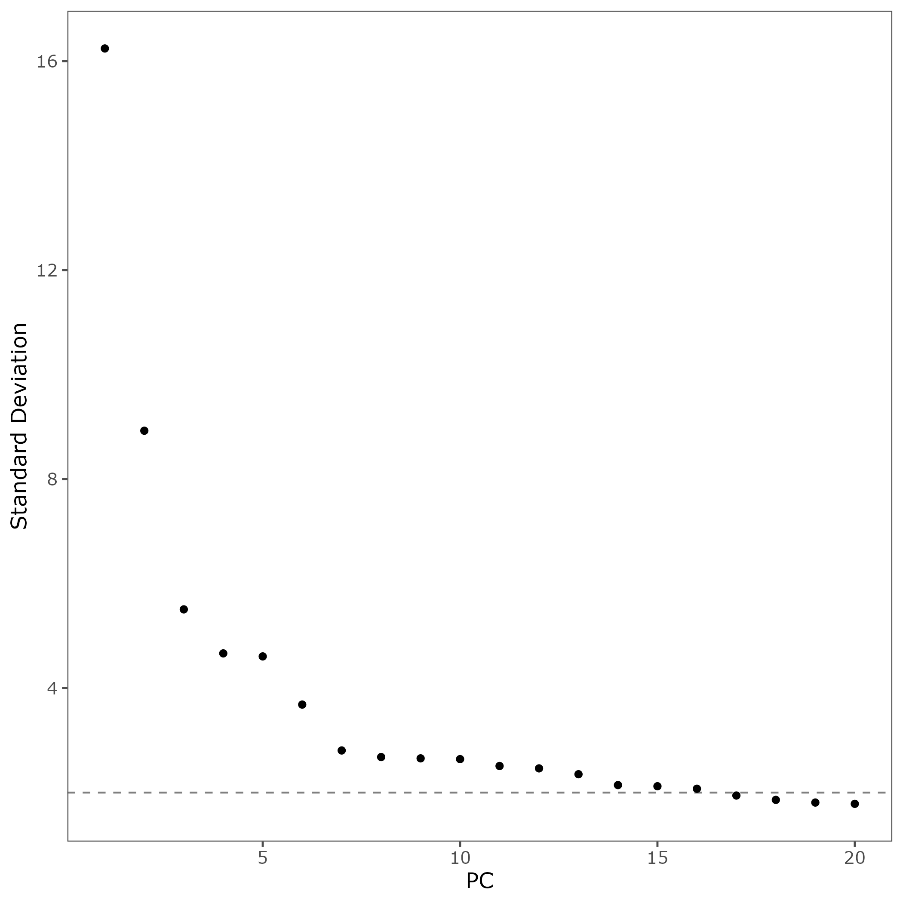
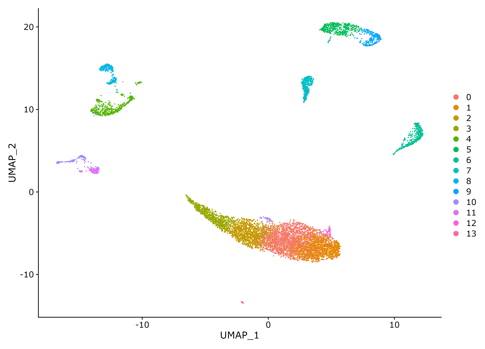
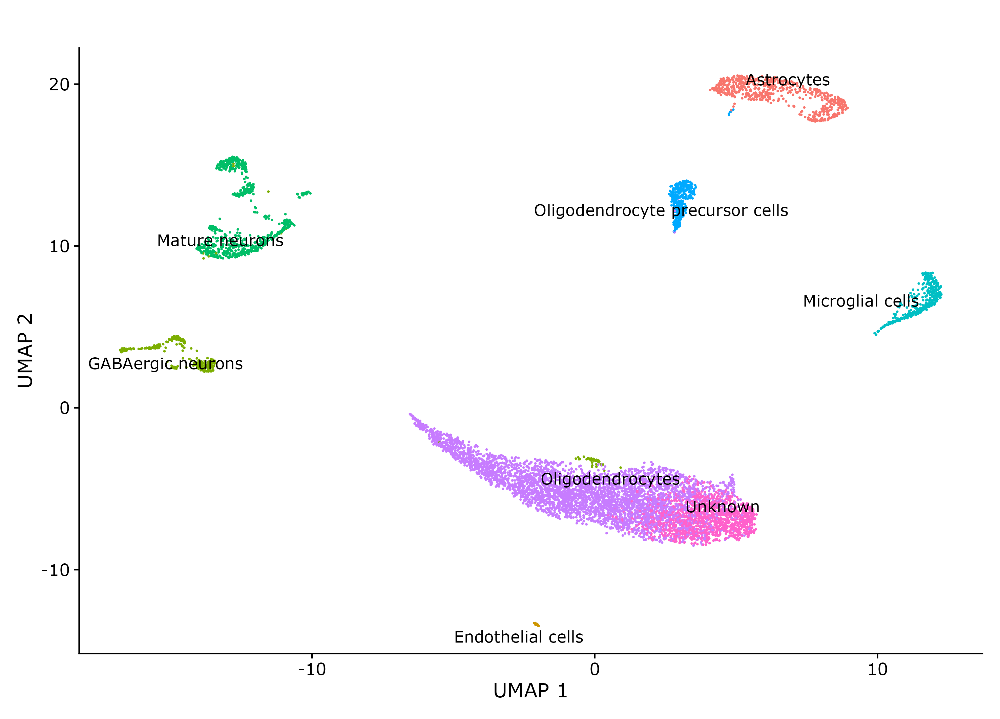
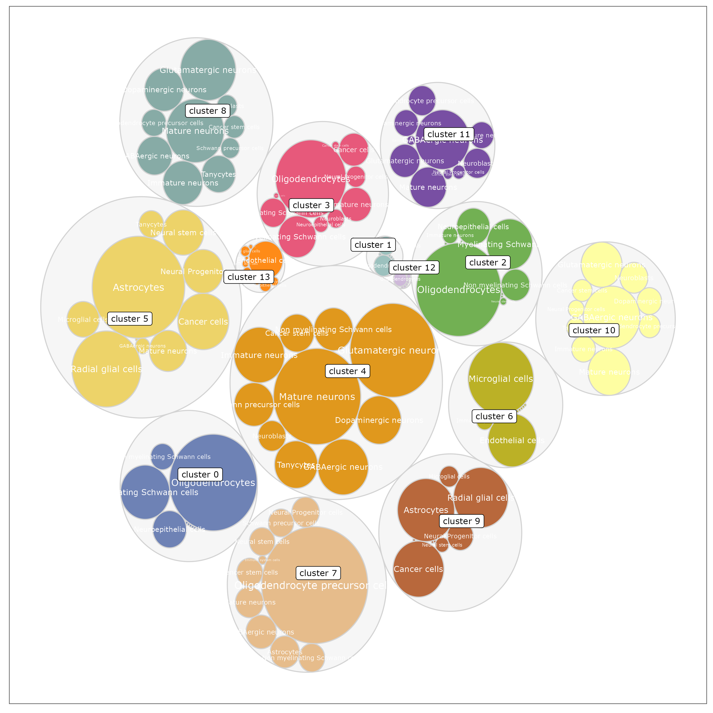
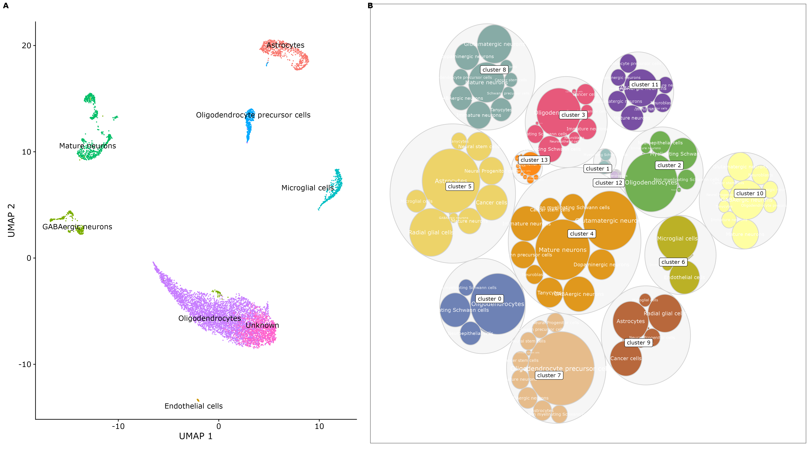

# Testing single cell annotation


Retrieve data from (already configured) rclone, hosted on google drive

```bash
module load rclone

rclone copy --drive-shared-with-me  dtigoogledrive:/Xylena_Test_Data/filtered_feature_matrix/features.tsv.gz .
rclone copy --drive-shared-with-me  dtigoogledrive:/Xylena_Test_Data/filtered_feature_matrix/barcodes.tsv.gz .
rclone copy --drive-shared-with-me  dtigoogledrive:/Xylena_Test_Data/filtered_feature_matrix/matrix.mtx.gz .

wget "https://raw.githubusercontent.com/IanevskiAleksandr/sc-type/master/R/gene_sets_prepare.R"
wget "https://raw.githubusercontent.com/IanevskiAleksandr/sc-type/master/R/sctype_score_.R"
wget "https://raw.githubusercontent.com/IanevskiAleksandr/sc-type/master/ScTypeDB_full.xlsx"
```

Run annotation with [`annotate.R`](annotate.R). Automatically loads `barcodes.tsv.gz`, `features.tsv.gz` and `matrix.mtx.gz`.

```bash
module load R/4.2
Rscript annotate.R
```











